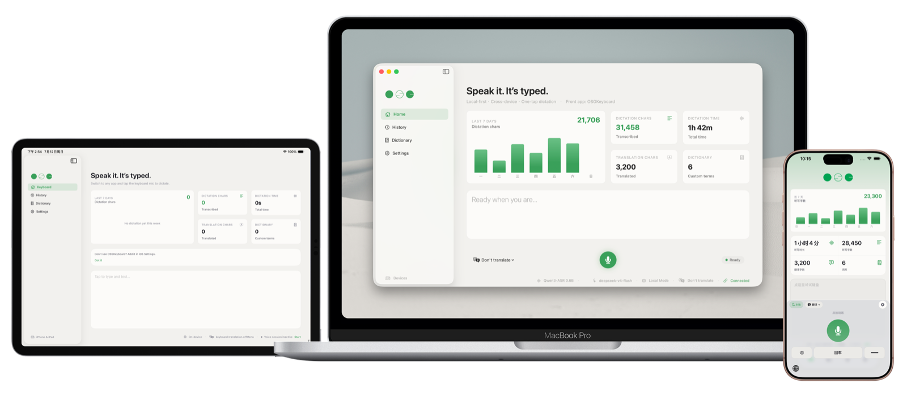

# OSGKeyboard

**开口即文字。会说你的话，会办你的事。**

OSGKeyboard 是面向 iPhone、iPad 与 Mac 的 AI 语音键盘：开口即文字，说出来的就像你自己写的——它是你的 AI 嘴替；复制之后还能替你回复、总结、建待办——它也是一把 Agentic 键盘。iOS 键盘把端侧听写、中英打字、AI 助手、剪贴板技能与可选托管积分放在同一个输入界面；Mac 提供按住 Option 即可使用的全局听写。默认端侧识别，核心功能无需账号。

<p align="center">
  
</p>


[官网](https://hkgood.github.io/OSGKeyboard/) · [TestFlight 公测](https://testflight.apple.com/join/c2Bz4qK9) · [English](./README.en.md) · [隐私政策](https://hkgood.github.io/OSGKeyboard/privacy/) · [更新记录](./CHANGELOG.md)

<p align="center">
  <a href="https://apps.apple.com/cn/app/osgkeyboard/id6781553267">
    
  </a>
  &nbsp;
  <a href="https://github.com/hkgood/OSGKeyboard/releases/download/v1.1-mac/OSGKeyboard-1.1.dmg">
    
  </a>
</p>

> 公开下载的 Mac DMG 是已签名并公证的历史版本 1.1。仓库中的 macOS target 随整体源码演进到 2.2；最新源码能力请用 Xcode 26 构建。
>
> 当前仓库版本以 [`project.yml`](./project.yml) 为准（`2.1.0` · build 110）。CHANGELOG 中 `2.2.0` 及更新的条目已经包含在本 README 的能力描述中。

## 一把键盘，四种输入方式

### 语音 + AI 助手：先预览，再插入

- 轻点麦克风开始听写，长按直接向 AI 提问；语音与 AI 共用同一个助手入口
- 回答流式显示，仅当原输入框与光标上下文仍匹配时才自动上屏
- 可口述修改最近一次由 OSGKeyboard 插入的文本，并选择替换或追加
- 根据当前输入框显示发送、搜索、前往、完成、下一步或换行
- 一次撤销覆盖听写、AI 回答、编辑与剪贴板粘贴

### 语音输入：端侧优先

- iOS / iPadOS 默认使用 Apple `SpeechAnalyzer` + `DictationTranscriber` 在设备端识别
- 个人词典与上下文热词帮助提升名字、术语与常用表达的识别准确率
- 可用语音修改最近一次由 OSGKeyboard 插入的文本
- 可选 AI 润色：9 种内置风格、自定义风格、轻松 / 加重两档趣味强度与可选情绪 emoji
- 可选「润色后翻译」：在润色基础上再翻成目标语言

### Agentic 剪贴板技能：复制之后，它替你做

- 剪贴板历史默认关闭，开启后最多保存 15 条纯文本，仅存于本机 App Group
- 复制后由本地语义分析理解内容该去哪，从完整技能目录中推荐最多 5 个相关操作
- 内置回复、总结、翻译、待办、日程、备忘录、地图导航（高德 / 百度 / Apple 地图）
- 提取待办与日程改用原生 EventKit 写入，无需安装配套捷径；日历只申请「仅写入」权限
- 可创建自定义技能：名称、SF Symbol、提示词与可选 iCloud 快捷指令
- 技能安装数量不限；技能页可安装、卸载、排序，键盘按当前剪贴板内容动态展示相关技能

### 中英打字：不方便说话时的兜底

- **中文**：全拼、自然码、小鹤、微软、搜狗双拼；模糊音、简拼排序、展开候选、数字选词、滑动选词、中英混输
- **英文**：三格 QuickType、约 4 万词离线词表、补全、纠错、下一词建议、撤销自动纠错、句首自动大写
- 输入体验：邻键纠错、叠指连打、长按连删、双空格句号、系统 Return 语义
- 一个个性词库同时参与中文候选、英文建议、语音偏置与润色保护

## AI 嘴替：说出来的，就像你自己写的

- **专属说话风格**：累积 2,500 个有效听写字符即可生成；优先学习你反复出现的口述与明确修改，保存前需你确认
- **个性回复**：普通、正式、轻松趣味三种语气一键切换；回复偏好与听写偏好分别学习，选择反馈仅保留在本机
- **个性词库**：重复使用的名字与术语，同时提升中文候选、英文建议与语音识别
- 风格学习与选择反馈只保存在本机；生成结果先给你审阅，确认后才保存

## 三种服务路径

OSGKeyboard 不把云端服务绑定为唯一选择：

1. **端侧** — 默认路径。iOS 本地听写无需账号或 API Key，原始录音不上传；Mac（Apple Silicon）默认使用本地 Qwen3 MLX 模型，Apple 语音识别作为备用。
2. **自备服务商（BYOK）** — 配置你自己的云端 ASR / LLM 凭证，请求直接发送到所选服务商；凭证保存在 Keychain。
3. **OSG 托管积分** — iOS / iPadOS 可选。Apple 登录后可使用托管语音与 AI，无需填写服务商凭证；首次启用前会明确说明离开设备的数据并征求同意。

本地听写和自备服务商始终可以独立使用，不要求 OSGKeyboard 账号。

首次引导会先用 App Attest 签发的短时匿名凭证，让用户各体验一次语音输入、剪贴板翻译、智能回复与长按问 AI；这四次教学不创建账号、不需要 API Key，也不消耗积分。体验后可跳过登录，或使用 Apple 登录领取符合条件的 1000 积分注册奖励。

## 可选账号与积分

iOS / iPadOS 账号中心支持：

- Sign in with Apple、资料管理、退出登录与 App 内账号注销
- 托管积分余额、App Store 消耗型积分包与邀请
- 服务端核验购买结果并维护积分账本
- 键盘扩展只接收短时、限权的托管服务凭证，主 App 账号令牌不会下发给键盘扩展

## 历史、统计与同步

- 首页集中展示当月日历、最近历史与个性词库；听写字数、时间、翻译字数与词库条数四张指标卡片可直接跳到详情
- 语音历史最多保留 300 条，可按天删除；最近确认的「润色前 ASR 转写」与风格元数据会一并留存，方便后续学习
- 设置、个性词库、润色风格、历史与统计可按类型选择经私有 iCloud 同步
- API Key 默认保存在 Keychain；仅在开启 iCloud 设置同步后经 iCloud 钥匙串复制。剪贴板历史、账号令牌与打字学习不会通过 iCloud 设置同步

## 稳定性与可恢复

- 键盘启动时按需加载引擎，键入过程中持续采样内存，并在 40 MiB / 48 MiB 阈值主动释放中文引擎、英文词库与在飞管线任务；正在拼字时会推迟重度释放
- iOS 26 起接入 MetricKit，将崩溃、卡顿、CPU 与磁盘写入诊断（含不会在 App Store Connect 中显示为崩溃的键盘扩展内存回收）记录在本机，可在「设置 ▸ 诊断」中导出
- 测试版（本地 Debug 与 TestFlight）会按设置开关批量上传上述诊断，方便排查 `0xdead10cc` 类回收；App Store 版本仅保留在本机
- CI 静态校验 App Group 标识符与共享 Keychain 访问组顺序，确保 App、键盘扩展、Mac 端与 `project.yml` 配置一致

## 平台能力

| 能力 | iOS / iPadOS 26+ | macOS 15+ |
|---|:---:|:---:|
| 系统键盘 / 全局热键 | 自定义键盘 | 按住 Option |
| 端侧语音识别 | Apple SpeechAnalyzer | Qwen3 MLX（Apple Silicon）+ Apple 语音回退 |
| 中文全拼 / 双拼 / 模糊音 | 支持 | — |
| 英文补全 / 纠错 / 下一词 | 支持 | — |
| AI 润色与翻译 | 支持 | 支持 |
| 统一助手与语音问答 | 支持 | — |
| 剪贴板历史与技能 | 支持 | — |
| 原生待办 / 日程写入 | 支持 | — |
| 可选 OSG 账号与托管积分 | 支持 | — |
| 个性词库、历史与统计 | 支持 | 支持 |
| iCloud 同步 | 设置、词库、历史与统计等可选同步 | 共享兼容数据 |

## 隐私原则

- **端侧优先**：本地识别时原始录音不离开设备
- **主动联网**：只有明确选择云端识别、润色、AI 或技能时，相关数据才会发送
- **路径透明**：自备服务商请求直达所选服务商；托管积分请求经 `account.osglab.com`
- **击键不上传**：中文候选学习与英文建议偏好保存在本机，密码框不学习
- **剪贴板可控**：历史默认关闭、最多 15 条、仅本机保存，不会自行发送给 AI
- **凭证隔离**：用户 API Key 保存在 Keychain；账号会话令牌只在主 App 私有 Keychain
- **无广告追踪**：不集成第三方分析、广告或追踪 SDK；可退出的第一方产品分析不采集输入内容，不出售个人数据

完整数据类型、保留策略、账号删除与第三方服务说明见[隐私政策](https://hkgood.github.io/OSGKeyboard/privacy/)。

## 常见问题

**必须注册 OSG 账号吗？**
不需要。端侧听写或自备服务商都不要求账号；Apple 登录仅用于托管积分、积分购买、邀请奖励与资料管理。

**录音会上传吗？**
默认的端侧识别不会上传录音。只有你明确选择自备云端识别或托管积分的云端识别时，音频才会离开设备，并发送至相应云端服务处理。

**键盘为什么需要「完全访问」？**
开启后键盘才能与主 App 共享设置、读取已保存的服务配置，并在你主动启用后访问剪贴板。此权限不代表 OSGKeyboard 会收集日常键入内容。

**OSGKeyboard 是开源软件吗？**
不是。项目采用源码可见许可，仅允许个人学习与非商用本地使用；再分发、公开衍生版本与商业使用需要获得许可。

**为什么 Mac 下载是 1.1？**
公开下载的 Mac DMG 是历史版本 1.1；仓库内的 Mac 源码已演进到 2.2，如需最新功能请在 macOS 上用 Xcode 26 或更高版本自行构建。

## 快速开始

### iPhone / iPad

1. 从 App Store 安装并打开 OSGKeyboard
2. 按引导添加键盘、开启「完全访问」，并授予麦克风与语音识别权限
3. 选择本地识别、自备服务商或可选托管积分
4. 在任意输入框切换到 OSGKeyboard：轻点听写、长按问 AI，或切换到中文 / English 打字

### Mac

1. 下载历史版 1.1 DMG，或从当前源码构建 `OSGKeyboardMac`
2. 授予麦克风与辅助功能权限
3. 在任意 App 按住 Option 说话，松开后插入结果

## 从源码构建

需要：

- macOS
- Xcode 26+
- [XcodeGen](https://github.com/yonaskolb/XcodeGen)

```bash
git clone https://github.com/hkgood/OSGKeyboard.git
cd OSGKeyboard
./Scripts/generate-xcodeproj.sh
open OSGKeyboard.xcodeproj
```

- iOS / iPadOS：选择 `OSGKeyboard` scheme，在 iOS 26 模拟器或真机运行
- macOS：选择 `OSGKeyboardMac` scheme，产物为 `OSGKeyboard.app`
- 测试：按 [docs/TESTING.md](./docs/TESTING.md) 的 suite manifest 与脚本执行

工程以 [project.yml](./project.yml) 为 XcodeGen 单一事实源，`.xcodeproj` 不进入版本控制。

## 架构速览

```text
OSGKeyboard/             iOS / iPadOS 主 App、Flow 会话与设置
OSGKeyboardExt/          自定义键盘扩展
OSGKeyboardMac/          macOS 菜单栏与全局听写
OSGKeyboardShared/       共享模型、输入、同步、AI 与设计系统
OSGKeyboardHostSupport/  主 App 专用 ASR、云端客户端、账号与 StoreKit
```

iOS 的 Flow 会话由主 App 负责采音和识别；键盘扩展通过 App Group 发送轻量命令并接收结果。托管服务使用短时、按 scope 限权的 grant，不把主 App 账号令牌暴露给键盘扩展。

开发规范、测试和贡献流程见 [CONTRIBUTING.md](./CONTRIBUTING.md)。版本变化见 [CHANGELOG.md](./CHANGELOG.md)。

## 鸣谢与第三方许可

主要依赖和灵感包括 Apple Speech、librime、librime-xcframework、rime-pinyin-simp、NanoMouse、Hamster、mlx-audio-swift、Peter Norvig 的公有领域 n-gram 统计，以及 Google Material Icons。

准确版本、许可证与 OSG 自有英文词表声明见 [NOTICE-TYPING.md](./NOTICE-TYPING.md)，也可在 App 的「设置 → 关于 → 第三方许可」中查看。

## 许可

[OSGKeyboard 源码可见许可](./LICENSE)不是开源或 MIT 许可。

- 允许：个人学习、非商用本地构建与使用
- 禁止：未经授权的再分发、公开衍生版本与商业使用
- 商业许可：[rocky.hk@gmail.com](mailto:rocky.hk@gmail.com)

<p align="center">
  开口即文字 · Speak it. It's typed.
</p>