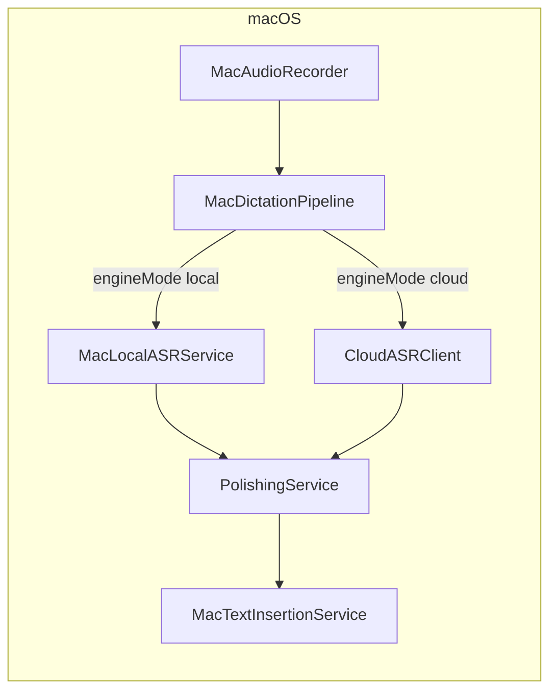
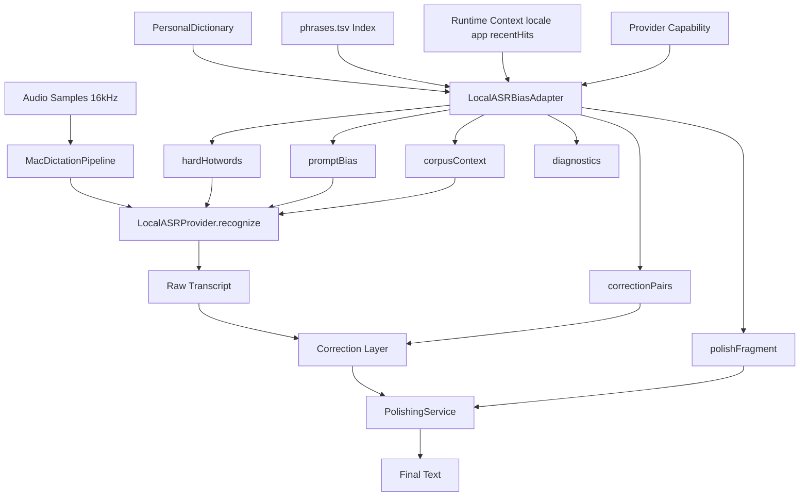
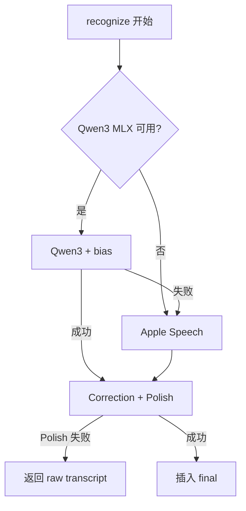

# OSGKeyboard 本地 ASR 技术架构

> **文档状态**：架构规划（非实现规格）  
> **适用范围**：macOS 本地听写；与 iOS 键盘扩展、云 ASR 路径的关系见各节说明。  
> **核心结论**：macOS 本地听写默认 **Qwen3 MLX 真流式**（mlx-audio-swift）；词库经 `LocalASRBiasAdapter` 以 soft prompt + 后处理注入。Sherpa offline 已移除。

---

## 1. Executive Summary

OSGKeyboard 的本地 ASR 竞争力不来自单一模型，而来自：

1. **用户 PersonalDictionary**（term / aliases / iCloud）
2. **内置技术词库**（`phrases.tsv` ≈ 1 万词，iOS 已用于 Apple CLM）
3. **分层 bias**：ASR 偏置 → 后处理纠错 → Polish 保真
4. **可替换的 Local ASR Provider**（Qwen3 MLX 主线，Sherpa / SenseVoice / Apple Speech 对照）

当前最大缺口：**macOS 本地路径未消费任何词库**；云路径已通过 `PersonalDictionary+ASRBias` 完整接线。

推荐路线：

| 阶段 | 动作 |
|------|------|
| **短期** | 保留 Qwen3 MLX；实现 `LocalASRBiasAdapter`；接 soft prompt + polish + aliases 后处理 |
| **中期** | ModelScope 优先的本地模型 catalog；Sherpa Qwen3 hotwords POC |
| **长期** | 按评测数据决定是否新增默认 provider 或保留 Qwen3 MLX |

---

## 2. 背景与问题定义

### 2.1 为什么本地 ASR 不能只讨论模型

语音输入的「专有名词准确率」由多层共同决定：

- **ASR 层**：听出 `Claude`、`SwiftUI`、`Qwen3-ASR`
- **后处理层**：`克劳德` → `Claude`
- **润色层**：保留品牌名、变量名，不擅自改写

闭源产品（Typeless 等）常把词典效果归因于云端 ASR；开源竞品（OpenLess、Typeflux、SayIt）表明：**词典必须按 backend 能力分层注入**，不能假设「一个 hotwords 数组走天下」。

### 2.2 OSG 相对竞品的结构性优势

| 能力 | OSGKeyboard | 典型开源竞品 |
|------|-------------|----------------|
| 用户词库 | `PersonalDictionary`（term + aliases + category + iCloud） | 多为 phrase-only |
| 内置领域词库 | ~10k `phrases.tsv` + iOS CLM | OpenLess preset ~20 词；SayIt server hotwords.txt ~30 词 |
| 云 ASR bias | 智谱 / 阿里 vocabulary / Whisper prompt | 单云或单 provider |
| iOS 本地 CLM | `SFCustomLanguageModelData` | macOS 路径未等价 |

### 2.3 设计目标

- 离线、隐私友好的 macOS 本地听写
- 复用 `PersonalDictionary` 与 `phrases.tsv` **源数据**（非 iOS `.bin` 直用）
- Provider 可替换；能力矩阵诚实声明（尤其热词模式）
- 模型下载可管理（**ModelScope 优先**，HF / GitHub 备用）
- 可评测、可灰度、可回退

### 2.4 非目标

- 不立即将主路径切到 FunASR Python server 或 Sherpa
- 不把 1 万词全量塞入 ASR prompt
- 不把 Polish 当作唯一纠错层
- 不承诺未 POC 验证的模型效果
- 第一期不强制实现 Typeflux 式「自动词库学习」（仅作可选实验设计）

---

## 3. 当前架构（代码事实）

### 3.1 端到端数据流



### 3.2 云路径 vs 本地路径

| 环节 | 云 ASR | 本地 ASR（当前） |
|------|--------|------------------|
| 入口 | `MacDictationPipeline.run` | 同左 |
| ASR | `CloudASRClientFactory` + `dictionary: store.personalDictionary` | `MacLocalASRService.transcribe(samples, locale)` **无 dictionary** |
| 词库 bias | `PersonalDictionary+ASRBias`（按 provider） | **无** |
| 润色 | `PolishingService` + `promptFragment()` | 同左（仅用词典做 polish，不经 ASR） |
| 默认模型 | 用户所选云 provider | Qwen3 MLX 1.7B；缺权重 → Apple Speech |

关键代码：

- [`OSGKeyboardMac/MacDictationPipeline.swift`](../OSGKeyboardMac/MacDictationPipeline.swift) — 本地分支未传 `personalDictionary`
- [`OSGKeyboardMac/MacLocalASRService.swift`](../OSGKeyboardMac/MacLocalASRService.swift) — Sherpa catalog models / Apple Speech fallback
- [`OSGKeyboardShared/Models/PersonalDictionary+ASRBias.swift`](../OSGKeyboardShared/Models/PersonalDictionary+ASRBias.swift) — 云侧 `asrHotwords` / `asrPromptBias` / 阿里热词表
- [`OSGKeyboardShared/Services/PolishingService.swift`](../OSGKeyboardShared/Services/PolishingService.swift) — 润色层消费 `dictionary.promptFragment()`

### 3.3 iOS 词库资产（macOS 不可直接复用）

- **内置词库**：[`OSGKeyboard/Resources/CustomLanguageModel/v1/phrases.tsv`](../OSGKeyboard/Resources/CustomLanguageModel/v1/phrases.tsv)（约 10,301 行，含 `word` / `pinyin` / `source` / `weight`）
- **Apple CLM**：[`OSGKeyboardShared/Services/CustomLanguageModelManager.swift`](../OSGKeyboardShared/Services/CustomLanguageModelManager.swift) → `SFSpeechLanguageModel.Configuration`，仅 iOS 26+ 中文本地 ASR 路径
- **结论**：macOS 需从 TSV + `PersonalDictionary` **重新适配**为 Qwen3 prompt / Sherpa hotwords / polish fragment，不能加载 `OSGKeyboardCLM.bin`

### 3.4 本地模型现状

- 默认模型：`sherpa-qwen3-0.6b-int8`（catalog 管理，安装于 `~/Library/Application Support/OSGKeyboard/`）
- 运行时：`sherpa-onnx-offline` 二进制（按架构下载，见 `local-asr-catalog.json`）
- Sherpa 引擎：[`MacSherpaLocalASR.swift`](../OSGKeyboardMac/MacSherpaLocalASR.swift) / [`MacSherpaONNXRunner.swift`](../OSGKeyboardMac/MacSherpaONNXRunner.swift) — Qwen3 支持 recognizer-scoped hotwords

---

## 4. 开源竞品源码观察

基于 GitHub topic `typeless-alternative` 及关联仓库（2026-03 快照）。

### 4.1 对比总表

| 项目 | 技术栈 | 本地 ASR | 热词 / 词库 | 可借鉴 | 不宜照搬 |
|------|--------|----------|-------------|--------|----------|
| **OpenLess** | Tauri/Rust | Qwen3 C 引擎、Apple Speech、Sherpa（Win） | 火山 `context.hotwords`；Whisper prompt；Polish hotword block；**本地 Qwen3 未接词典** | 多 provider + polish 双层 | 本地热词叙事过度乐观 |
| **Typeflux** | Swift/macOS | SenseVoice、FunASR、Qwen3 Sherpa CLI、WhisperKit | `VocabularyStore` cap 500；Doubao hotwords；Whisper prompt；**Sherpa 本地无热词**；自动项目词 + 编辑后学习 | Swift 原生、词库排序、自动学习（作实验） | Sherpa 仅 CLI 离线，无 hotwords 接线 |
| **SayIt** | Tauri + FastAPI | sherpa-onnx Rust：**Qwen3 recognizer 创建时写 hotwords** | 内置主题词 + 自定义；云 Qwen corpus；server `hotwords.txt` | **本地 Qwen3 hard hotwords 实证**；跨 provider `StartOptions.hotwords` | 服务端 vLLM 非 macOS 客户端主线 |
| **VoiceSnap** | Go/Wails | SenseVoice + sherpa-onnx | **无个性化词库** | 离线体验：静音截断、剪贴板保护、填充词过滤 | 无万级词库场景 |
| **OpenBroca** | Electron | Sherpa 等 | Dictionary hotword/replacement | **one-shot `recognize` first**；model catalog、sha256、selected model | Electron 栈 |

### 4.2 对 OSG 的启示

1. **学架构，不学「本地已完整支持热词」的 README 叙事**（OpenLess 本地 Qwen3 缺口与 OSG 类似）。
2. **SayIt 证明**：sherpa-onnx `OfflineQwen3ASRModelConfig.hotwords` 可在 recognizer 创建时注入；热词变化需 **重建 recognizer**（缓存 key 含 hotwords 字符串）。
3. **Typeflux 证明**：`activeTerms()` 上限 500 + 动态排序；但 Sherpa Qwen3/SenseVoice 命令行路径**未传** vocabulary prompt。
4. **OpenBroca 证明**：runtime 不得静默选「目录里第一个模型」；须 `selectedModelId` + manifest。

---

## 5. 目标架构

### 5.1 管道总览



### 5.2 三层职责边界

| 层 | 职责 | 禁止 |
|----|------|------|
| **ASR bias** | 提高听写阶段专有名词概率 | 承担全文语法润色 |
| **Correction** | 高置信 `aliases → term` 替换 | 凭热词表改写普通句意 |
| **Polish** | 标点、口语转书面、热词保真 | 单独承担全部专名纠错 |

---

## 6. Local ASR Provider 抽象

### 6.1 One-shot first

借鉴 OpenBroca：macOS 听写主路径为 **录完后一次性 `recognize`**；流式预览（`transcribe` / partial）为可选能力，非第一期必做。

建议协议（概念层）：

```swift
protocol LocalASRProvider {
    var capabilities: LocalASRCapabilities { get }
    func recognize(
        samples: [Float],
        sampleRate: Int,
        locale: Locale,
        bias: LocalASRBiasPayload?,
        options: LocalASRRecognizeOptions?
    ) async throws -> LocalASRResult
}
```

### 6.2 能力矩阵（须诚实声明）

除 `supportsStreaming`、`maxHotwordCount` 外，**必须区分热词模式**：

| 字段 | 含义 |
|------|------|
| `hotwordMode` | `none` / `promptOnly` / `perRequest` / `recognizerScoped` / `cloudVocabulary` |
| `hotwordStrength` | `weak` / `medium` / `strong`（产品文案用，非科学绝对值） |
| `hotwordReloadCost` | `none` / `recognizerReload` / `modelReload` |
| `maxPromptCharacters` | soft prompt 上限 |
| `maxHotwordCount` | hard hotwords 上限 |
| `supportsLanguageHint` | 是否接受 locale → language hint |

### 6.3 各 Backend 定位（规划）

| Provider | 角色 | hotwordMode（规划） | 备注 |
|----------|------|---------------------|------|
| **Qwen3 MLX** | 短期主线 | `promptOnly`（待接 `qwen_set_prompt` 等价 API） | 已有权重路径；改动面最小 |
| **Sherpa Qwen3** | 中期 POC | `recognizerScoped` | SayIt 同款；热词变更加载成本 |
| **SenseVoice** | 对照 | `none` 或弱 prompt | 速度/中文基线；非热词主线 |
| **Apple Speech** | Fallback | `none`（macOS CLM 待验证） | 系统稳定 |
| **Cloud ASR** | 质量上限 | 各云 `PersonalDictionary+ASRBias` | 非离线 |

**暂不主推**：Sherpa Paraformer 作为热词主线（官方不支持 Paraformer hotwords，与 transducer/Qwen3 不同）。

---

## 7. LocalASRBiasAdapter 设计

### 7.1 输入

| 输入 | 说明 |
|------|------|
| `PersonalDictionary.effectiveEntries` | 用户词；最高优先级 |
| `BuiltinLexiconIndex` | 自 `phrases.tsv` 构建；按 weight / 场景筛选 |
| `locale` | `store.localeId` |
| `frontAppBundleId` | 可选；技术类 App 提升 IT 子集权重 |
| `recentHitTerms` | 历史命中统计（若已有） |
| `providerCapabilities` | 决定输出哪些字段、如何截断 |

### 7.2 输出 `LocalASRBiasPayload`

```swift
struct LocalASRBiasPayload {
    var hardHotwords: [String]           // Sherpa Qwen3、部分云 API
    var promptBias: String?              // Qwen3 MLX、Whisper 系
    var corpusContext: String?           // Qwen 云 corpus 风格（若将来统一）
    var polishFragment: String           // PolishingService 追加块
    var correctionPairs: [(alias: String, term: String)]
    var diagnostics: BiasDiagnostics   // 供设置页 / 调试
}

struct BiasDiagnostics {
    var userTermCount: Int
    var builtinTermCount: Int
    var truncated: Bool
    var truncationReason: String?
    var selectedSources: [String]      // e.g. user, builtin-it, builtin-top
}
```

### 7.3 优先级与截断

```
用户高频 / 最近命中
  > PersonalDictionary（全部有效 term）
  > 当前 App 相关内置词（phrases 子集）
  > 高 weight 内置技术词（Top-N）
  > 其余内置词（仅 polish / 检索，不进 ASR）
```

默认建议（可 POC 调参）：

| 输出 | 默认上限 |
|------|----------|
| `hardHotwords` | 100（Qwen3 Sherpa）；对齐 `asrHotwords(maxCount: 100)` |
| `promptBias` | 800 字符；复用 `asrPromptBias(maxCharacters:)` 逻辑 |
| ASR 层内置词 | 200–500；**不全量 1 万** |
| `correctionPairs` | aliases 全量可进后处理，但仅 **整词 / 高置信** 替换 |

### 7.4 防污染规则

- 近静音、极短音频：减少或跳过内置词，保留用户词。
- 用户词始终优先于内置词。
- diagnostics 必须记录「为何丢弃」某批词（超 cap、provider 不支持、场景不匹配）。

### 7.5 与现有云代码复用

扩展 [`PersonalDictionary+ASRBias.swift`](../OSGKeyboardShared/Models/PersonalDictionary+ASRBias.swift) 为 **单一事实来源**，新增例如：

- `localPromptBias(maxCharacters:builtinTerms:)`
- `correctionPairs()`
- `rankedTermsForASR(limit:builtinBoost:)`

避免 macOS / iOS / Cloud 三套独立拼接逻辑。

---

## 8. 词库策略

### 8.1 PersonalDictionary

| 字段 | ASR | Correction | Polish |
|------|-----|------------|--------|
| `term` | hotword / prompt | 标准写法 | 必须保留 |
| `aliases` | 可进 prompt 提示 | **主战场** | 语义纠错参考 |
| `category` | 排序权重 | — | 分组展示 |
| `usageCount` | 排序权重 | — | — |

iCloud：[`PersonalDictionaryCloudSync`](../OSGKeyboardShared/Services/PersonalDictionaryCloudSync/) 保证 Mac / iOS / Extension 一致；本地 ASR 只读 `AppGroupStore.personalDictionary`。

### 8.2 phrases.tsv 分层

**不全量进入 ASR prompt。**

| 层级 | 用途 | 规模建议 |
|------|------|----------|
| L1 ASR 高价值 | `weight >= 4` 或 curated IT 品牌缩写 | 200–500 |
| L2 场景相关 | 按 `frontApp` / 用户最近命中动态加入 | +0–100 |
| L3 全量索引 | 后处理模糊匹配、polish 检索 | ~10k |

TSV 列：`word`、`pinyin`、`source`、`weight` — 构建索引时保留 weight 用于排序。

### 8.3 iOS CLM 与 macOS 关系

- iOS：TSV → export script → `.bin` → `CustomLanguageModelManager`
- macOS：TSV → `BuiltinLexiconIndex` → `LocalASRBiasAdapter` → Qwen3 / Sherpa / Polish
- **同一 TSV 源**，两种消费格式；不尝试把 `.bin` 喂给 Sherpa/MLX

---

## 9. 自动词库学习（可选实验，非第一期）

借鉴 Typeflux `WorkflowController+AutomaticVocabulary`：

- 听写插入后，短时观察用户在前台可编辑框内的修改
- LLM 或规则判断是否为「专名 / 品牌 / 大小写修正」
- 候选进入 **待确认队列**，不直接写入 `PersonalDictionary`

**约束（必须写进隐私说明）**：

- 默认关闭
- 不自动 iCloud 同步待确认项
- 可一键清空、可审计来源
- 拒绝：整句改写、纯语法修正、过短词条、编辑幅度过大

OSG 已有 `PersonalDictionary.Entry.Source.recentEdit` 与合并逻辑，可与之对齐而非新建平行存储。

---

## 10. 本地模型管理

### 10.1 原则

- **Catalog 与 Runtime 分离**：下载源只影响安装；推理只读本地 **已验证 manifest**
- **Selected model 显式**：禁止「扫描目录用第一个 onnx」
- **完整性**：sha256 或 size 校验 + staging 目录原子发布

### 10.2 存储布局（建议）

```
~/Library/Application Support/OSGKeyboard/
  LocalASRModels/
    manifest.json                 # 已安装模型、版本、backend、capabilities
    runtimes/sherpa-onnx-1.13.4-macos-arm64/
    models/sherpa-qwen3-0.6b-int8/
    sherpa-sensevoice-small/
```

### 10.3 Catalog 条目（概念）

```json
{
  "modelId": "sherpa-qwen3-asr-0.6b-int8",
  "displayName": "Qwen3-ASR 0.6B (Sherpa)",
  "backend": "sherpaQwen3",
  "sizeBytes": 1200000000,
  "recommendedLocales": ["zh-CN", "en-US"],
  "supportsHotwords": true,
  "hotwordMode": "recognizerScoped",
  "sources": [
    {
      "type": "modelscope",
      "url": "https://www.modelscope.cn/api/v1/models/.../repo?Revision=master&FilePath=...",
      "sha256": "...",
      "priority": 1
    },
    {
      "type": "huggingface",
      "url": "https://huggingface.co/...",
      "priority": 2
    },
    {
      "type": "github",
      "url": "https://github.com/k2-fsa/sherpa-onnx/releases/download/...",
      "priority": 3
    }
  ]
}
```

### 10.4 ModelScope 策略

| 场景 | 策略 |
|------|------|
| 中国大陆用户默认 | **ModelScope 优先**（Qwen3-ASR、SenseVoice、FunASR 相关 ONNX） |
| 国际 / ModelScope 失败 | Hugging Face → GitHub Releases |
| 企业内网 | `custom` mirror URL（用户配置） |
| 安装流程 | download → verify → extract → validate required files → rename staging → update manifest |
| 失败 | 清理 staging / 临时文件；不留下半安装状态 |

MLX Qwen3 权重：可继续支持用户自选目录（现状），逐步纳入统一 catalog 的 `type: mlx` 条目。

### 10.5 UI / 设置需求（规划）

- 模型列表：体积、语言、安装状态、是否支持热词
- 下载进度：phase（downloading / extracting / validating / finalizing）
- 切换模型：仅允许 **installed + manifest 合法** 的项为默认
- 诊断：当前 provider、capability、上次 bias diagnostics

---

## 11. 后端对比与决策矩阵

### 11.1 产品分层

```text
主线:     Qwen3 MLX + LocalASRBiasAdapter + Polish/Correction
重点 POC: Sherpa Qwen3 hotwords
对照:     SenseVoice（速度）、Apple Speech（fallback）
参考上限: Cloud ASR + PersonalDictionary
团队部署: Qwen3-ASR vLLM（SayIt 式，非客户端主线）
暂不主推: FunASR Paraformer hotwords、纯 OpenLess 本地词典叙事
```

### 11.2 详细对比

| 维度 | Qwen3 MLX | Sherpa Qwen3 | SenseVoice | Apple Speech | Cloud |
|------|-----------|--------------|------------|--------------|-------|
| 离线 | ✅ | ✅ | ✅ | ✅ | ❌ |
| 中英混合技术词 | 强（经验性） | 待 POC | 中 | 中 | 强 |
| Hard hotwords | ❌→prompt | ✅ recognizerScoped | ❌ | ❌ | ✅ 因 provider 异 |
| 实现成本 | 低（已有） | 高（runtime 体积） | 中 | 低 | 已有 |
| 模型体积 | ~1.3GB+ | 类似 | ~350MB 级 | 0 | N/A |
| 隐私 | 本地 | 本地 | 本地 | 本地 | 依配置 |

### 11.3 Sherpa POC 通过阈值（建议）

相对 **当前 Qwen3 MLX + 仅 polish** 基线：

| 指标 | 建议阈值 |
|------|----------|
| 用户热词召回率 | 提升 ≥ 20% |
| 误触发率（未说热词却被改成热词） | ≤ 2% |
| 30s 音频端到端延迟 | ≤ 基线 × 1.5 |
| 内存峰值（8GB Mac 目标机） | 可接受且无 OOM |
| 安装成功率 | 普通用户可完成 ModelScope/HF 下载 |

未达阈值：**保留 Qwen3 MLX 主线**，Sherpa 仅作高级选项。

---

## 12. POC 评测计划

### 12.1 测试集

| 类别 | 内容 | 目的 |
|------|------|------|
| A 普通中文 | 日常口语 50 句 | 基线 WER / 误触发 |
| B 技术术语 | SwiftUI、Cursor、Qwen3-ASR 等 50 句 | 专名召回 |
| C 用户词典 | 模拟 PersonalDictionary 20 词 × 多句 | 热词核心场景 |
| D 长句润色 | 30s+ 口语 | polish 兜底 |
| E 噪声 / 短句 | 低 SNR、<2s | 防污染规则 |

### 12.2 对照矩阵

| 配置 | 说明 |
|------|------|
| Baseline | Qwen3 MLX，无 bias |
| B1 | Qwen3 MLX + promptBias |
| B2 | B1 + polishFragment + correction |
| POC1 | Sherpa Qwen3 + hardHotwords |
| POC2 | SenseVoice，无 hotwords |
| Ref | 云 ASR + PersonalDictionary |

### 12.3 指标

- Raw CER/WER（中文可用字错误率）
- **Hotword recall**（用户词是否出现在 raw 或 final）
- **False hotword rate**
- Final accuracy（用户主观或编辑距离）
- Latency：record end → text inserted
- Memory / CPU、模型加载时间
- 离线可靠性（无网络完成全流程）

---

## 13. 失败回退策略



| 条件 | 行为 |
|------|------|
| Qwen3 权重缺失 | Apple Speech（现状） |
| Qwen3 推理失败 | 可配置：重试一次 → Apple Speech |
| Sherpa 未安装 | 不回退云；提示下载 |
| 模型 manifest 损坏 | 标记 invalid，禁止设为默认 |
| Polish 失败 | 使用 raw（现状） |
| 用户禁用云 | 不静默切云 |

---

## 14. 分阶段落地路线

| Phase | 内容 | 交付物 |
|-------|------|--------|
| **1** | 本文档定稿；`LocalASRCapabilities` + `LocalASRBiasPayload` 类型设计 | 架构文档 + ADR 可选 |
| **2** | `MacDictationPipeline` 接入 adapter；Qwen3 MLX `promptBias`；polish + correction | 实现 PR |
| **3** | `BuiltinLexiconIndex`；Top-N；diagnostics UI | 实现 PR |
| **4** | Model catalog + ModelScope 下载 + manifest | 实现 PR |
| **5** | Sherpa Qwen3 POC + 评测报告 | 决策是否默认切换 |
| **6** | 可选：自动词库学习实验（默认关） | 功能 flag |

---

## 15. 风险与待确认问题

| 风险 | 缓解 |
|------|------|
| Qwen3 prompt bias 过弱 | POC 对比 Sherpa hard hotwords；保留 correction + polish |
| 热词过多污染识别 | cap + 场景筛选 + diagnostics |
| aliases 后处理误改 | 整词边界、低置信跳过 |
| Sherpa 分发体积 / 签名 / 公证 | 单独评估；可选按需下载 |
| Apple Speech macOS CLM | 调研 macOS 26+ 是否可接 CLM；否则仅 fallback |
| ModelScope API 变更 | 多 mirror；manifest 可更新 URL |
| 自动学习隐私 | 默认关、本地、待确认 |
| 低配 Mac 内存 | 单模型常驻策略；SenseVoice 作轻量选项 |

**待确认**：

1. MLX Swift API 是否暴露等价 `setPrompt`（对标 Open-Less/qwen-asr `qwen_set_prompt`）
2. Sherpa-ONNX Swift/SPM 与 App Store 公证路径
3. `phrases.tsv` Top-N 是否按 `weight` 静态裁剪即可，或需按 App 动态检索

---

## 16. 相关代码索引

| 主题 | 路径 |
|------|------|
| Mac 听写管道 | `OSGKeyboardMac/MacDictationPipeline.swift` |
| 本地 ASR 入口 | `OSGKeyboardMac/MacLocalASRService.swift` |
| Sherpa local ASR | `OSGKeyboardMac/MacSherpaLocalASR.swift`, `MacSherpaONNXRunner.swift` |
| Apple Speech fallback | `OSGKeyboardMac/MacSpeechLocalASR.swift` |
| 用户词库 | `OSGKeyboardShared/Models/PersonalDictionary.swift` |
| 云 bias | `OSGKeyboardShared/Models/PersonalDictionary+ASRBias.swift` |
| 内置 TSV | `OSGKeyboard/Resources/CustomLanguageModel/v1/phrases.tsv` |
| iOS CLM | `OSGKeyboardShared/Services/CustomLanguageModelManager.swift` |
| 润色 | `OSGKeyboardShared/Services/PolishingService.swift` |
| 文本插入 | `OSGKeyboardMac/MacTextInsertionService.swift` |

---

## 17. 修订记录

| 日期 | 说明 |
|------|------|
| 2026-03-31 | 初版：基于 OSG 代码审计 + typeless-alternative 竞品源码 + 计划评审（ModelScope、hotwordMode、回退策略） |
