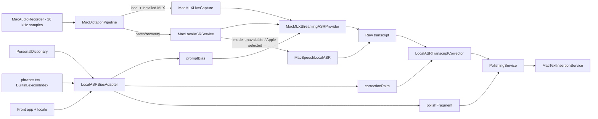

# OSGKeyboard 本地 ASR 技术架构

> **文档状态**：1.7.0 代码事实 + 后续评测方向
> **适用范围**：macOS 15+ 本地听写；iOS 26+ 使用 Apple SpeechAnalyzer。
> **当前结论**：Mac 默认安装目录模型为
> `qwen3-mlx-0.6b-4bit`，通过 `mlx-audio-swift` 做 Qwen3 MLX 真流式识别；
> 模型不可用时走 Apple Speech fallback。Sherpa 已不在当前 catalog 或运行路径中。

## 1. 架构摘要

本地 ASR 的专有名词质量由三层共同完成：

1. **ASR bias**：`PersonalDictionary` 与内置技术词经
   `LocalASRBiasAdapter` 生成 Qwen3 `promptBias`。
2. **确定性纠错**：识别后按个人词库 `aliases → term` 做边界受控替换。
3. **Polish 保真**：把内置词参考作为补充上下文交给润色层；无 API Key 或润色失败时
   仍返回本地识别与纠错结果。

这三层已经接入 Mac 的 live 与 batch 路径。“Mac 本地路径不消费词库”不再是当前事实。

## 2. 当前端到端数据流


```mermaid
flowchart LR
    Audio["MacAudioRecorder · 16 kHz samples"] --> Pipeline["MacDictationPipeline"]
    Dict["PersonalDictionary"] --> Bias["LocalASRBiasAdapter"]
    Lexicon["phrases.tsv · BuiltinLexiconIndex"] --> Bias
    App["Front app + locale"] --> Bias
    Bias --> Prompt["promptBias"]
    Bias --> Pairs["correctionPairs"]
    Bias --> PolishTerms["polishFragment"]

    Pipeline -->|local + installed MLX| Live["MacMLXLiveCapture"]
    Pipeline -->|batch/recovery| Local["MacLocalASRService"]
    Live --> Qwen["MacMLXStreamingASRProvider"]
    Local --> Qwen
    Local -->|model unavailable / Apple selected| Apple["MacSpeechLocalASR"]
    Prompt --> Qwen
    Qwen --> Raw["Raw transcript"]
    Apple --> Raw
    Raw --> Correct["LocalASRTranscriptCorrector"]
    Pairs --> Correct
    Correct --> Polish["PolishingService"]
    PolishTerms --> Polish
    Polish --> Insert["MacTextInsertionService"]
```

### 2.1 引擎选择与回退

| 项目 | 当前事实 |
|---|---|
| 默认模型 ID | `qwen3-mlx-0.6b-4bit` |
| 可选 MLX 模型 | 0.6B 4-bit、1.7B 4-bit |
| Catalog | `OSGKeyboard/Resources/LocalASR/local-asr-catalog.json` |
| 下载源 | `hf-mirror.com` 与 Hugging Face repository files |
| 推理 | `MLXAudioSTT.Qwen3ASRModel` |
| Live partial | 100 ms 音频 feed；流式 session 定期 decode |
| Batch | 同一 MLX 模型的 `generate(audio:context:language:)` |
| Fallback | Apple Speech 的本地 `SFSpeechURLRecognitionRequest` |

旧 Sherpa model ID 只在偏好迁移逻辑中映射到当前 MLX 默认值，不代表 Sherpa
backend 仍可运行。当前 catalog 的 `runtimes` 为空。

### 2.2 词库接线

`MacDictationPipeline.resolveLocalBias` 与 `MacMLXLiveCapture.resolveBias` 都读取
`store.personalDictionary`，再调用：

```text
LocalASRBiasAdapter.adapt(
  dictionary + locale + frontAppBundleId + backend capabilities
)
```

适配器当前输出：

| 输出 | 当前消费者 |
|---|---|
| `promptBias` | Qwen3 MLX streaming `StreamingConfig.context` 与 batch `generate(context:)` |
| `correctionPairs` | `LocalASRTranscriptCorrector`，在 polish 前修正 aliases |
| `polishFragment` | `PolishingService` 的 `dictionarySupplement` |
| `diagnostics` | `LocalASRBiasDiagnosticsStore` |
| `hardHotwords` | 为具备 hard-hotword capability 的 backend 保留；当前 Qwen3 MLX 不使用 |

个人词优先；`BuiltinLexiconIndex` 从 `phrases.tsv` 选择 `weight >= 4` 的 Top-N，
代码编辑器/终端前台场景优先 `computer_terms`。默认最多考虑 300 个内置 ASR 词，
Qwen3 soft prompt 最长 800 字符，润色补充最多 40 个内置词。

### 2.3 Apple Speech fallback

Apple fallback 强制 `requiresOnDeviceRecognition = true`，系统缺少对应语言模型时会
明确失败，不会静默切云。中文路径会准备打包的 Apple Custom Language Model；
个人词库仍参与识别后的 alias 纠错与 polish 保真。

当前 `LocalASRCapabilities.appleSpeech` 声明 `hotwordMode = none`，因此不要把
`contextualStrings` 描述为已经由个人词库动态注入。相关 API 虽有适配入口，但当前
capability 不生成 hard hotwords。

## 3. 代码索引

| 主题 | 当前路径 |
|---|---|
| Mac 听写编排 | `OSGKeyboardMac/MacDictationPipeline.swift` |
| 本地引擎选择 / fallback | `OSGKeyboardMac/MacLocalASRService.swift` |
| MLX live capture | `OSGKeyboardMac/MacMLXLiveCapture.swift` |
| MLX provider | `OSGKeyboardMac/MacMLXStreamingASRProvider.swift` |
| MLX streaming session | `OSGKeyboardMac/MacMLXStreamingSession.swift` |
| Apple Speech fallback | `OSGKeyboardMac/MacSpeechLocalASR.swift` |
| Bias payload / capability | `OSGKeyboardShared/Models/LocalASRBiasPayload.swift`, `LocalASRCapabilities.swift` |
| Bias 构建 | `OSGKeyboardShared/Services/LocalASRBiasAdapter.swift` |
| 内置词索引 | `OSGKeyboardShared/Services/BuiltinLexiconIndex.swift` |
| 用户词库 | `OSGKeyboardShared/Models/PersonalDictionary.swift` |
| 云 ASR bias | `OSGKeyboardShared/Models/PersonalDictionary+ASRBias.swift` |
| Apple CLM | `OSGKeyboardHostSupport/Services/CustomLanguageModelManager.swift` |
| 内置 TSV | `OSGKeyboard/Resources/CustomLanguageModel/v1/phrases.tsv` |

## 4. 设计目标与边界

### 4.1 目标

- Mac 本地听写离线可用，音频默认不离开设备。
- iOS 与 Mac 复用 `PersonalDictionary` 和 `phrases.tsv` 的源数据。
- 每个 backend 如实声明 soft prompt、hard hotword、streaming 与 reload 成本。
- 模型下载、校验、安装和选择显式可管理。
- 质量、延迟、内存与误触发均可量化评测。
- 本地失败不静默回退云端。

### 4.2 非目标

- 不把一万词全量塞进 ASR prompt。
- 不把 polish 当作唯一专名纠错层。
- 不把尚未进入 catalog/runtime 的 Sherpa 或 SenseVoice 描述成当前能力。
- 不承诺未经同一测试集验证的模型质量。
- 不把 iOS 生成的 CLM `.bin` 直接喂给 MLX 或其他 backend。

## 5. 能力模型

`LocalASRCapabilities` 区分：

| 字段 | 含义 |
|---|---|
| `hotwordMode` | `none` / `promptOnly` / `perRequest` / `recognizerScoped` / `cloudVocabulary` |
| `maxPromptCharacters` | soft prompt 上限 |
| `maxHotwordCount` | hard hotword 上限 |
| `supportsStreaming` | 是否提供真流式 partial |
| `hotwordReloadCost` | `none` / `recognizerReload` / `modelReload` |

当前实际运行矩阵：

| Backend | 当前角色 | Bias | Streaming |
|---|---|---|---|
| Qwen3 MLX | Mac 默认 | `promptOnly`，800 字符 | 是 |
| Apple Speech | Mac fallback / 显式选择 | ASR 层 `none`；后处理与 polish 仍接词库 | 否 |
| iOS SpeechAnalyzer | iOS 主路径 | Apple CLM + 本地纠错 | 渐进结果 |
| Cloud ASR | 用户显式选择 | 按 provider 使用个人词库 | 按 provider |

## 6. 竞品研究中仍有效的结论

基于 2026-03 的公开源码快照，保留以下架构结论，不把它们当作 OSG 当前实现：

| 项目 | 观察 | 对 OSG 的启示 |
|---|---|---|
| OpenLess | 多 provider；本地 Qwen3 词典接线有限 | README 不能把统一词库接口等同于 backend 已消费 |
| Typeflux | 词库限额、动态排序、项目词学习 | Top-N 与上下文排序有价值；自动学习必须可确认 |
| SayIt | Sherpa Qwen3 recognizer-scoped hotwords | 若未来重做 Sherpa POC，词库变化需计入 recognizer 重建成本 |
| VoiceSnap | SenseVoice 离线与静音处理 | 可作为速度/资源基线，不代表具备个性词库 |
| OpenBroca | 显式 model selection 与 manifest | 禁止扫描目录后任取第一个模型 |

这些研究只支撑未来实验。当前发布架构仍是 Qwen3 MLX + Apple Speech fallback。

## 7. 模型管理

当前安装由 catalog 描述 repository files、模型布局与体积，安装状态由 manifest
和必要文件校验决定。设计原则保持：

- Catalog 与 runtime 分离。
- `selectedModelId` 显式保存；旧 ID 有确定迁移规则。
- 下载进入 staging，经校验后原子发布。
- 无效或未安装模型不能假装可用。
- 中国大陆镜像与官方 Hugging Face 可按偏好选择。

ModelScope、自定义企业镜像与额外 backend 可以作为后续 catalog 扩展，但不是
1.7.0 当前下载路径。

## 8. 评测方法

### 8.1 测试集

| 类别 | 内容 | 目的 |
|---|---|---|
| A 普通中文 | 日常口语 50 句 | CER / 误触发基线 |
| B 技术术语 | SwiftUI、Cursor、Qwen3-ASR 等 50 句 | 专名召回 |
| C 用户词典 | 20 个个人词，每词多句 | bias 与 alias 纠错 |
| D 长句 | 30 秒以上口语 | streaming 稳定性与 finalize |
| E 噪声 / 短句 | 低 SNR、少于 2 秒 | 幻觉与热词污染 |
| F 中英混合 | 技术会议和代码口述 | 语言提示与专名保真 |

### 8.2 当前对照矩阵

| 配置 | 说明 |
|---|---|
| Baseline | Qwen3 MLX 0.6B，不传 bias |
| B1 | 0.6B + `promptBias` |
| B2 | B1 + alias correction + polish supplement |
| Quality | Qwen3 MLX 1.7B + B2 |
| Fallback | Apple Speech + correction / polish |
| Reference | 用户所选 Cloud ASR + `PersonalDictionary` |

未来 Sherpa/SenseVoice 只能作为新增 POC 行，不能替换当前 baseline 名称。

### 8.3 指标

- Raw CER/WER。
- 用户词 raw/final hotword recall。
- False hotword rate。
- 录音结束到最终插入的延迟，以及 live partial 首次可见延迟。
- 8 GB Apple-silicon Mac 上的峰值内存、CPU 与模型加载时间。
- 无网络完成率、模型安装成功率、fallback 成功率。

若未来评估 hard-hotword backend，建议门槛：

- 用户词召回相对当前 Qwen3 MLX + B2 提升至少 20%。
- False hotword rate 不高于 2%。
- 30 秒音频端到端延迟不超过当前基线 1.5 倍。
- 分发体积、签名、公证与 8 GB 设备内存均可接受。

## 9. 回退与风险

| 条件 | 当前/要求行为 |
|---|---|
| MLX 模型未安装 | 使用 Apple Speech fallback |
| MLX live 失败 | 返回 batch recovery 信号 |
| Apple 本地语言模型缺失 | 明确报错并提示系统下载，不切云 |
| Polish 缺 Key、超时或失败 | 返回本地识别/纠错文本 |
| 用户禁用云 | 不静默切换云 ASR |
| 热词 dump / 近静音幻觉 | 丢弃可疑 live 结果并尝试 batch |

主要后续风险：

1. 800 字符 soft prompt 对低频专名的提升有限。
2. 内置 Top-N 过多会污染短句或近静音输入。
3. alias 替换必须保持整词/高置信边界。
4. 1.7B 模型在低配 Mac 上的内存与首载延迟需持续量化。
5. 新 backend 必须先证明收益，再承担下载、签名和维护成本。

## 10. 后续方向

1. 用固定测试集持续比较 0.6B / 1.7B、无 bias / 分层 bias。
2. 将 diagnostics 与实际命中/截断数据用于调节 Top-N 和 prompt 上限。
3. 验证 Apple Speech fallback 的个人词动态提示能力后，再决定是否修改 capability。
4. 只有 hard-hotword 收益达到阈值时，才恢复 Sherpa Qwen3 POC。
5. 自动词库学习若实验，必须默认关闭、本地处理、用户确认后写入，并可审计/清空。

## 11. 修订记录

| 日期 | 说明 |
|---|---|
| 2026-08-11 | 按 1.7.0 代码重写：Qwen3 MLX streaming 默认、Apple Speech fallback、LocalASRBiasAdapter/PersonalDictionary 已接线；移除 Sherpa 当前路径叙述 |
| 2026-03-31 | 初版竞品研究与评测框架 |
