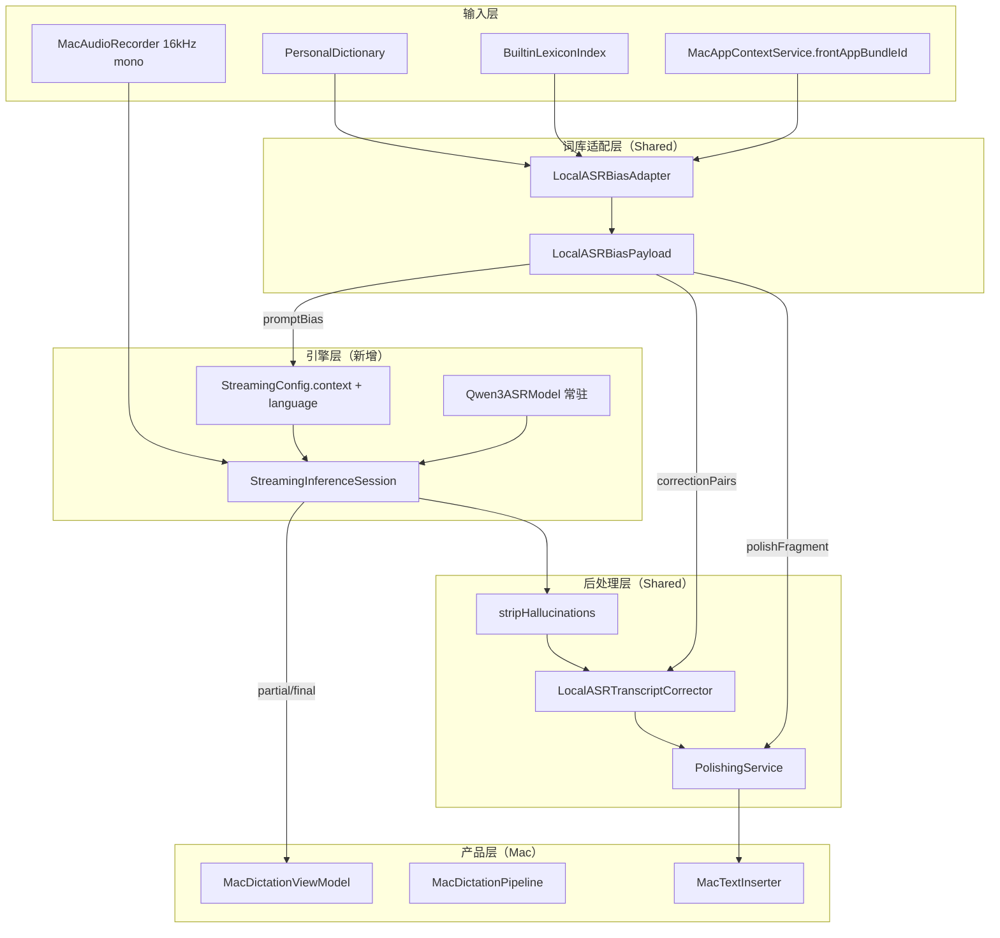

# Mac 本地 ASR 迁移计划：Whisperer 流式 + 词库分层

> **文档状态**：实施计划（待评审）  
> **适用范围**：macOS 本地听写（`OSGKeyboardMac`）  
> **关联文档**：[`local-asr-architecture.md`](./local-asr-architecture.md)  
> **创建日期**：2026-07-14  

---

## 1. Executive Summary

### 1.1 目标

将 macOS 本地听写从 **Sherpa offline CLI 分块架构** 迁移到 **Qwen3-ASR + mlx-audio-swift 真流式引擎**（Whisperer 路线），并完整支持：

1. **iOS 同源用户自定义词库**（`PersonalDictionary`：term / aliases / iCloud）
2. **系统预设增强词库**（`phrases.tsv` → `BuiltinLexiconIndex`）
3. **分层 bias**：ASR soft prompt → 别名纠错 → Polish 保真
4. **按住说话实时出字**（边说边 partial，松开后短 tail + final）

### 1.2 核心结论

| 决策 | 选择 |
|------|------|
| **引擎** | `Blaizzy/mlx-audio-swift`（`MLXAudioSTT` + `StreamingInferenceSession`） |
| **模型** | Qwen3-ASR 0.6B 4-bit（默认）/ 1.7B 4-bit（高质量档） |
| **热词模式** | `promptOnly`（`StreamingConfig.context`），**禁用** Sherpa hard hotwords |
| **词库适配** | 复用现有 `LocalASRBiasAdapter`，不新建平行词库系统 |
| **废弃** | Sherpa Qwen3 offline 子进程 + `ChunkedUtterancePipeline` 本地主线 |

### 1.3 非目标（本期不做）

- 不替换 iOS 键盘扩展的本地/云 ASR 路径
- 不把 1 万 builtin 词全量塞进 ASR prompt
- 不恢复 Sherpa `--qwen3-asr-hotwords` 作为默认
- 不引入 Python sidecar（`mlx-qwen3-asr` HTTP worker）作为默认
- 不强制实现 Typeflux 式自动词库学习（仅预留接口）
- 不在 Linux CI 上跑 MLX 集成测试（见 `AGENTS.md`）

---

## 2. 背景与现状差距

### 2.1 当前 Mac 本地路径（问题）

```text
Option 按下 → MacAudioRecorder
           → liveCaptureTask + ChunkedUtterancePipeline
           → MacSherpaONNXRunner（每 chunk 起子进程）
           → --qwen3-asr-hotwords（hard hotwords，易静音幻觉）
           → 首 partial ~2.5s，松开后队列拖很久
```

| 问题 | 根因 |
|------|------|
| 松开后仍录/识别很久 | 无 tail drain；chunk 队列串行跑完 |
| 静音喷热词 | hard hotwords + 无 VAD 门控 |
| 实时预览慢 | `firstChunkDurationSeconds=2.5` + offline 子进程 |
| 词库未完整消费 | `LocalASRBiasAdapter` 已生成 payload，Sherpa 只用 `hardHotwords`，忽略 `promptBias` / correction / polish |

### 2.2 目标 Mac 本地路径

```text
Option 按下
  → resolveLocalBias()（PersonalDictionary + BuiltinLexiconIndex）
  → Qwen3ASRModel.fromPretrained()（常驻）
  → StreamingInferenceSession(context: promptBias)
  → 100ms feedAudio → displayUpdate → UI partial +（可选）增量插入
Option 松开
  → FlowCaptureTailDrain（250–500ms）
  → session.stop() → final text
  → LocalASRTranscriptCorrector（aliases）
  → PolishingService（polishFragment）
  → 注入前台 App
```

### 2.3 与 iOS 词库的关系

| 数据源 | Mac 读取方式 | 用途 |
|--------|--------------|------|
| `AppGroupStore.personalDictionary` | iCloud KVS + 本地 | 用户 term / aliases |
| `phrases.tsv`（bundle 资源） | `BuiltinLexiconIndex.shared` | 系统增强词库 Top-N |
| `PersonalDictionary+ASRBias` | 经 `LocalASRBiasAdapter` | prompt / correction / polish |

**Mac 与 iOS 共用同一套词库数据与 adapter 逻辑**，不 fork 词库模型。

---

## 3. 目标架构

### 3.1 分层图



### 3.2 Provider 抽象（建议）

新增 `MacMLXStreamingASRProvider`，实现窄接口：

```swift
protocol MacStreamingASRSession: Sendable {
    func feed(samples: [Float])
    func stop() async -> String
    func cancel()
    var events: AsyncStream<TranscriptionEvent> { get }
}

protocol MacStreamingASRProviding {
    func prepare() async throws
    func makeSession(bias: LocalASRBiasPayload, locale: Locale) throws -> any MacStreamingASRSession
}
```

Sherpa / Apple Speech 保留为 **fallback provider**，不作为默认。

### 3.3 词库 payload 消费矩阵

| `LocalASRBiasPayload` 字段 | Whisperer/MLX 路线 | 说明 |
|---------------------------|-------------------|------|
| `promptBias` | `StreamingConfig.context` | 用户词 + builtin Top-N（≤800 字符） |
| `hardHotwords` | **丢弃** | 禁用，防幻觉 |
| `correctionPairs` | `LocalASRTranscriptCorrector` | aliases 确定性替换 |
| `polishFragment` | `PolishingService` supplement | builtin 补充 + 专名保真 |
| `diagnostics` | `LocalASRBiasDiagnosticsStore` | 设置页展示 |

---

## 4. 分阶段实施计划

### Phase 0 — 决策冻结与文档（0.5 周当量）

**产出**

- [ ] 评审并批准本文档
- [ ] 更新 [`local-asr-architecture.md`](./local-asr-architecture.md) 核心结论：默认引擎改为 mlx-audio-swift，Sherpa hard hotwords 降级为 advanced/deprecated
- [ ] 确认 `LocalASRCapabilities.qwen3MLX.supportsStreaming = true`（类型层）

**验收**

- 团队对引擎选型、词库分层、非目标无歧义

---

### Phase 1 — 引擎依赖与 mlx-audio-swift patch（P0）

**目标**：Mac target 可链接 MLX，streaming 支持 `context`。

**任务**

1. **SPM 依赖**（`project.yml`）
   - 添加 `Blaizzy/mlx-audio-swift`（`MLXAudioSTT`, `MLXAudioCore`）
   - 确认 Metal Toolchain / `mlx.metallib` 打包流程（参考 Whisperer `make bundle`）
   - 更新开源许可 catalog

2. **Fork 或 upstream PR：`StreamingConfig.context`**
   - 在 `StreamingConfig` 增加 `public var context: String?`
   - `QwenStreamingInferenceSessionCore` 两处 `buildPrompt` 传入 `context`
   - 若短期无法 upstream：vendored fork pin 到 OSG 分支

3. **模型 catalog 更新**（`local-asr-catalog.json`）
   - 新增条目：`qwen3-mlx-0.6b-4bit`、`qwen3-mlx-1.7b-4bit`
   - `backend: mlx`，`hotwordMode: promptOnly`
   - 默认模型 ID 从 `sherpa-qwen3-0.6b-int8` 改为 `qwen3-mlx-0.6b-4bit`
   - 保留 Sherpa 条目但标记 `deprecated` / 高级选项

4. **新文件骨架**
   - `OSGKeyboardMac/MacMLXStreamingASRProvider.swift`
   - `OSGKeyboardMac/MacMLXStreamingSession.swift`
   - `OSGKeyboardMac/MacHallucinationFilter.swift`（移植 Whisperer 逻辑）

**验收**

- macOS 上 `Qwen3ASRModel.fromPretrained` 加载成功
- 固定 WAV 文件 batch transcribe 有输出
- 传入 `context: "Cursor, SwiftUI"` 时专名召回优于无 context（人工 smoke）

**风险**

- `project.yml` 当前零 SPM；首次引入 MLX 需验证 XcodeGen + 签名 + metallib
- GitHub Actions macOS runner Xcode 版本（见 `AGENTS.md` CI 说明）

---

### Phase 2 — 流式会话 + 词库接入（P0）

**目标**：按住 Option 时真流式 partial；词库经 `LocalASRBiasAdapter` 注入。

**任务**

1. **`MacMLXStreamingASRProvider`**
   - 模型常驻 singleton（类似 VoxFlow `SpeechSwiftQwen3ModelCache`）
   - Metal warmup：1s 静音 pre-transcribe（学 MacWispr）
   - `makeSession(bias:locale:)` → `StreamingConfig(context: bias.promptBias, language: ...)`

2. **替换 `MacDictationViewModel` 录音循环**
   - 删除/绕开 `liveCaptureTask` + `ChunkedUtterancePipeline` 本地路径
   - 学 Whisperer `AppState`：
     - 按下：创建 session + 100ms `feedAudio` timer
     - 监听 `session.events` → 更新 `transcript` / `isStreamingPartial`
     - 松开：进入 Phase 3 tail drain

3. **`MacDictationPipeline.resolveLocalBias`**
   - 已有实现保留；capabilities 改为 `.qwen3MLX`
   - 确保 `hardHotwords` 不被下游使用

4. **语言映射**
   - 复用 `MacQwen3LanguageHint.from(locale:)` 或 mlx-audio 语言别名表

**验收**

- 按住说话 **< 1s** 出现 partial（M 系列，0.6B 模型）
- 设置页 diagnostics 显示 `promptBiasLength > 0`、用户词/builtin 计数
- 用户词典中的 term 在 prompt 中可见（debug log）

---

### Phase 3 — 松开截断 + 后处理链（P0）

**目标**：解决「松开后仍录很久」；完整词库后处理。

**任务**

1. **接入 `FlowCaptureTailDrain`**（Shared，iOS 已有）
   - Mac `MacAudioRecorder` 松开后启用 tail drain
   - 参数：`silenceDurationSeconds: 0.25–0.5`，`maxDrainSeconds: 0.5–1.0`
   - drain 期间继续 `feedAudio`；超时硬截断

2. **Session 结束**
   - `session.stop()` → 等待 `.ended(fullText:)`
   - `MacHallucinationFilter.strip`（CJK filler、空白标记）

3. **后处理链**（对齐 iOS 云路径语义）
   ```text
   raw → stripHallucinations
       → LocalASRTranscriptCorrector.apply(pairs: bias.correctionPairs)
       → PolishingService（mergedDictionaryBlock + polishFragment）
       → final transcript
   ```

4. **取消路径**
   - Option 二次按下 / Esc：`session.cancel()` + 清空 partial

**验收**

- 松开后 **≤ 500ms** 进入 finalizing（正常环境）
- aliases 纠错：`k8s` → `Kubernetes`（单元 + 人工）
- 静音段不喷词库词（hard hotwords 已禁用）

---

### Phase 4 — VAD / 静音门控（P1）

**目标**：减少静音 chunk 送模型、降低幻觉与算力浪费。

**任务**

1. RMS 门控（轻量，先上）
   - feed 前检测 chunk RMS < threshold 则跳过（学 VoxFlow `silencePeakThreshold: 0.0005`）

2. 可选：Silero VAD（speech-swift 或自研）
   - 仅在 Phase 4 评估后引入；避免双引擎依赖膨胀

3. **热词 dump 过滤器**（Shared utility）
   - 若 final 文本主要由词库词构成且音频能量低 → 丢弃

**验收**

- 静音按住 3s 无输出 / 不插入
- 嘈杂环境 tail drain 不无限拖

---

### Phase 5 — 设置、迁移与 fallback（P1）

**任务**

1. **`MacLocalASRModelSettingsView`**
   - 模型档：0.6B（默认）/ 1.7B
   - 流式窗口：`streamingWindow` 0.5–3s（默认 1–2s）
   - Bias diagnostics：userTermCount / builtinTermCount / truncated / promptLength

2. **用户迁移**
   - 已选 `sherpa-qwen3-*` 的用户自动映射到 `qwen3-mlx-0.6b-4bit`
   - 首次启动提示：本地引擎升级，需下载 MLX 权重

3. **Fallback 链**
   ```text
   qwen3-mlx 失败 → Apple Speech（现有 MacSpeechLocalASR）
   模型缺失 → 引导下载 / 云模式
   ```

4. **废弃路径标记**
   - `MacSherpaONNXRunner` / `MacSherpaLocalASR` 保留但默认隐藏
   - `MacLocalASRChunkAdapter` 仅 cloud chunked 或 legacy flag 使用

**验收**

- 老用户升级后默认本地模式仍可用
- 设置页可看到词库注入诊断

---

### Phase 6 — 评测、灰度与文档（P2）

**任务**

1. **评测集**（见 §6）
2. **Benchmark 脚本**（可选，学 MacWispr `bench.sh`）
   - latency RTF、首 partial 延迟、专名召回
3. **CHANGELOG** 双语条目
4. **用户文档**：本地模式说明、词库如何生效、与云模式差异

**灰度**

- 内部 dogfood → 默认开启 MLX 本地 → 移除 Sherpa 默认（保留 advanced）

---

## 5. 文件级变更清单

### 5.1 新增

| 文件 | 职责 |
|------|------|
| `OSGKeyboardMac/MacMLXStreamingASRProvider.swift` | 模型加载、session 工厂、bias→config |
| `OSGKeyboardMac/MacMLXStreamingSession.swift` | 封装 `StreamingInferenceSession` + event 转发 |
| `OSGKeyboardMac/MacHallucinationFilter.swift` | 静音幻觉过滤 |
| `OSGKeyboardMac/MacStreamingAudioFeeder.swift` | 100ms 定时 feed + RMS 门控 |
| `OSGKeyboardTests/MacMLXStreamingASRTests.swift` | mock / 可选 macOS CI smoke |

### 5.2 修改

| 文件 | 变更 |
|------|------|
| `project.yml` | SPM：`mlx-audio-swift`；Copy Bundle Resources 不变 |
| `OSGKeyboardShared/Resources/LocalASR/local-asr-catalog.json` | MLX 模型条目 + 默认 ID |
| `OSGKeyboardShared/Models/LocalASRCapabilities.swift` | `qwen3MLX.supportsStreaming = true` |
| `OSGKeyboardMac/MacDictationViewModel.swift` | 流式 session 生命周期 |
| `OSGKeyboardMac/MacDictationPipeline.swift` | 本地路径走 MLX；后处理链接 |
| `OSGKeyboardMac/MacLocalASRService.swift` | 新 backend `mlxQwen3` |
| `OSGKeyboardMac/MacAudioRecorder.swift` | tail drain 钩子 |
| `OSGKeyboardMac/MacLocalASRModelSettingsView.swift` | 模型档 + diagnostics |
| `docs/local-asr-architecture.md` | 与本文对齐 |

### 5.3 废弃（保留代码，默认不启用）

| 文件 | 说明 |
|------|------|
| `OSGKeyboardMac/MacSherpaONNXRunner.swift` | hard hotwords 路径 |
| `OSGKeyboardMac/MacLocalASRChunkAdapter.swift` | Sherpa chunked |
| `OSGKeyboardShared/.../ChunkedUtterancePipeline.swift` | Mac 本地不再使用 |

---

## 6. 词库策略（详细）

### 6.1 输入与优先级

与 [`local-asr-architecture.md` §7.3](./local-asr-architecture.md) 一致：

```text
用户高频 / usageCount
  > PersonalDictionary.effectiveEntries（含 systemEntries）
  > 当前 App 相关 builtin（computer_terms 子集）
  > BuiltinLexiconIndex.topTerms(weight≥4, limit=300)
  > 其余 builtin（仅 polish，不进 ASR）
```

### 6.2 参数默认值

| 参数 | 值 | 来源 |
|------|-----|------|
| `hotwordMode` | `.promptOnly` | `LocalASRCapabilities.qwen3MLX` |
| `maxPromptCharacters` | **800** | 现有 capabilities；POC 可调 500–800 |
| `builtinASRLimit` | **300** | `LocalASRBiasRequest` 默认 |
| `builtin in prompt block` | **80** | `buildPromptBias` 现有逻辑 |
| `builtinPolishLimit` | **40** | polish supplement |
| `hardHotwords` | **0** | 显式禁用 |

### 6.3 用户词 vs 系统词库

| 类型 | ASR context | correction | polish |
|------|-------------|------------|--------|
| 用户 `term` | ✅ 优先 | — | ✅ |
| 用户 `aliases` | ✅ 误识别提示 | ✅ 硬替换 | — |
| builtin Top-N | ✅ 部分（≤80） | — | ✅（≤40） |
| 全量 1 万 builtin | ❌ | ❌ | 间接 |

### 6.4 Session 级 snapshot

- 每次 **Option 按下** 时调用一次 `LocalASRBiasAdapter.adapt`
- 整段 utterance 使用同一 `promptBias`（不在段内改 context）
- 前台 App 变化下一段生效（`MacAppContextService.frontmostBundleIdentifier()`）

---

## 7. 评测计划

### 7.1 场景集

| ID | 场景 | 词库侧重 | 通过标准 |
|----|------|----------|----------|
| A | 中文日常 20 句 | 无 | WER 可接受 |
| B | 中英混合技术句 50 句 | builtin | 专名 ≥ 基线 |
| C | 用户词典 20 词 × 多句 | PersonalDictionary | 召回 ≥ 90% |
| D | aliases（k8s→Kubernetes） | correction | 100% 替换 |
| E | 静音 5s 按住 | 词库 | 无输出 / 无词库幻觉 |
| F | 松开截断 | — | finalize ≤ 500ms |

### 7.2 对比基线

| 基线 | 说明 |
|------|------|
| B0 | 当前 Sherpa offline + hard hotwords |
| B1 | MLX streaming，无 bias |
| B2 | MLX streaming + promptBias |
| B3 | B2 + correction + polish |
| Ref | 云 ASR + PersonalDictionary |

**采纳门槛**：B3 专名场景 ≥ B0，且 E/F 显著优于 B0。

### 7.3 性能指标

| 指标 | 目标（0.6B，M 系列） |
|------|---------------------|
| 首 partial 延迟 | **< 1s**（streamingWindow 1–2s） |
| RTF | **< 0.1**（10s 音频） |
| 模型常驻内存 | **~1–1.5 GB** |
| 松开后 finalize | **≤ 500ms**（含 tail drain） |

---

## 8. 风险与缓解

| 风险 | 影响 | 缓解 |
|------|------|------|
| mlx-audio-swift streaming 无 context | 热词无法进 ASR | Phase 1 patch；fallback 仅后处理 |
| SPM + metallib 打包失败 | 无法发版 | 参考 Whisperer Makefile；CI macOS 验证 |
| soft prompt 弱于云 hotwords | 专名召回下降 | correction + polish；POC 调 prompt 模板 |
| 流式 partial 抖动 | UI 体验差 | agreement passes 默认；UI 只显示 confirmed |
| 用户磁盘 / 下载 | 首次体验差 | 0.6B 优先；进度 UI；可选云 fallback |
| Linux VM 无法测 MLX | CI 缺口 | 单元测 adapter/后处理；macOS 手动 + CI smoke |

---

## 9. 回滚策略

1. **Feature flag**：`mac.localASR.backend = mlxQwen3 | sherpaQwen3 | appleSpeech`
2. **模型级回滚**：catalog 默认指回 Sherpa（不推荐长期使用）
3. **云模式**：本地失败自动提示切换云 ASR（现有路径）
4. **词库不受影响**：adapter 层与引擎解耦，回滚不改词库

---

## 10. 成功标准（Definition of Done）

- [ ] 默认本地引擎为 Qwen3 MLX streaming，Sherpa 非默认
- [ ] 按住 Option **< 1s** 出现 partial
- [ ] 松开后 **≤ 500ms** 进入 final（正常环境）
- [ ] 用户 `PersonalDictionary` + `phrases.tsv` 经 `LocalASRBiasAdapter` 注入
- [ ] `hardHotwords` 在 MLX 路径为零
- [ ] aliases 经 `LocalASRTranscriptCorrector` 生效
- [ ] 静音不喷词库词
- [ ] 设置页展示 bias diagnostics
- [ ] CHANGELOG + 架构文档更新
- [ ] macOS Xcode 16+ 构建通过

---

## 11. 里程碑总览

```text
Phase 0  决策冻结 ─────────────────────────────► 文档批准
Phase 1  引擎依赖 + context patch ─────────────► MLX 可加载、batch smoke
Phase 2  流式 + 词库接入 ───────────────────────► 按住 partial + promptBias
Phase 3  tail drain + 后处理 ───────────────────► 松开快、aliases 生效
Phase 4  VAD / 静音门控 ────────────────────────► 无静音幻觉
Phase 5  设置 / 迁移 / fallback ───────────────► 用户可升级
Phase 6  评测 / 灰度 / 发布 ────────────────────► 默认 MLX，Sherpa deprecated
```

---

## 12. 参考实现

| 项目 | 学什么 | 链接 |
|------|--------|------|
| Whisperer | 100ms feed、delta insert、幻觉过滤 | [mosquito/whisperer](https://github.com/mosquito/whisperer) |
| mlx-audio-swift | `StreamingInferenceSession`、Qwen3 `context` batch API | [Blaizzy/mlx-audio-swift](https://github.com/Blaizzy/mlx-audio-swift) |
| VoxFlow | 词库矩阵、`LocalASRBiasAdapter` 式 prompt | [xingbofeng/VoxFlow](https://github.com/xingbofeng/VoxFlow) |
| MacWispr | context 词库、Metal warmup | [vasanthsreeram/macwispr](https://github.com/vasanthsreeram/macwispr) |
| OSG Shared | tail drain、adapter、corrector | `FlowCaptureTailDrain.swift`、`LocalASRBiasAdapter.swift` |

---

## 13. 开放问题（评审时确认）

1. **mlx-audio-swift 依赖方式**：直接 pin `main` vs fork 带 `context` patch？
2. **partial UI vs 增量插入**：Mac 默认仅 overlay 预览，还是像 Whisperer 边说边插入？
3. **0.6B vs 1.7B 默认**：质量优先还是延迟优先？
4. **Sherpa 条目何时从 catalog 移除**：灰度后一个版本 vs 长期保留 advanced？
5. **是否 Phase 4 引入 Silero VAD**：或 RMS 门控足够？

---

*文档维护：实施过程中若引擎 API 或 catalog 结构变化，请同步更新本节与 `local-asr-architecture.md`。*
