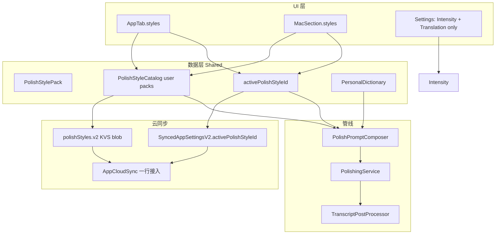

# 润色风格包（Polish Style Packs）实施计划

> **文档状态**：实施计划（**已评审，决策已冻结**）
> **适用范围**：iOS 主 App + 键盘扩展管线 + macOS（`OSGKeyboard` / `OSGKeyboardExt` / `OSGKeyboardMac` / `OSGKeyboardShared`）
> **分支**：`feature/polish-style-packs`
> **参考竞品**：OpenLess Style Pack（完整写作人格 + 运行时装配）
> **关联代码史**：`1bdb882`（polish scenarios）→ `4ab60ba`（删除手动场景，改依赖 AppContext）
> **创建日期**：2026-07-25

---

## 1. Executive Summary

### 1.1 目标

为 OSGKeyboard 恢复并升级「多润色风格」能力：用户在主 App（及 Mac）选择 **完整写作人格包**，每次听写润色按 active pack 装配 system prompt；支持自定义包与 **iCloud 同步**。

对齐产品约束：

1. **入口**：主 App Tab（词库与设置之间）+ Mac 侧栏对称项；**键盘顶栏不加 chip**
2. **形态**：学 OpenLess — 每包是 **整段可编辑 prompt**，不是短 StyleDirective
3. **横切能力保留**：词典、Intensity、`globalOutputContract`、`TranscriptPostProcessor`
4. **云端**：active id 进设置同步；用户包列表学词库走独立 KVS blob
5. **少冗余**：**一条装配管线、一套模型、一处导航枚举、一份云同步模式**

### 1.2 核心结论（冻结）

| 决策 | 选择 |
|------|------|
| **产品单元** | Style Pack（完整写作人格），非旧 Scenario 短 directive |
| **内置包** | 4 个：`builtin.light` / `builtin.structured` / `builtin.formal` / `builtin.chat` |
| **默认 active** | `builtin.light`（非法 / 缺失 id 回落至此） |
| **自定义上限** | ≤ **8** 个 user pack；单包 prompt ≤ **6 000** 字符 |
| **Intensity** | **保留**全局 light/medium/heavy，装配时追加短 guideline（与包正交） |
| **AppContext** | **降级**为可选上下文前提（短）；不再充当风格人格 |
| **装配** | 唯一 `PolishPromptComposer`（由现 `buildPrompt` 演化）；禁止平行 builder |
| **翻译** | 第一期 **不**把 Style Pack 拼进 `TranslationPrompt` |
| **键盘 UI** | 第一期 **不加** ScenarioChip / 风格切换 |
| **Mac** | 与 iOS **同迭代**做侧栏入口 + Shared 数据层 |
| **云同步** | 跟随现有 iCloud 总开关；不新建独立 sync toggle |
| **旧 Scenario** | **不复活** `ScenarioPrompt` / `ScenarioStyleDirective`；可复用部分 `polishScenario.*` 显示名 |

### 1.3 非目标（本期不做）

- OpenLess Marketplace / ZIP 导入导出 / 运行时 diagnostics 大页
- 键盘顶栏风格切换、热键轮换
- 把 Intensity 收进包内（可二期评估）
- 社交场景（小红书 / 微博 / 逗比 / TODO）作为内置包（可作「从模板新建」二期）
- Onboarding 新增风格步骤
- 新建第二套 `StylePolishingService` 或把 styles 塞进 `PersonalDictionary`
- 在 Linux CI 上跑需 Xcode 的集成测试（见 `AGENTS.md`）

---

## 2. 背景与现状差距

### 2.1 历史

| Commit | 说明 |
|--------|------|
| `1bdb882` | 完整多场景：`PolishScenario` + `ScenarioPrompt` + `ScenarioStyleDirective` + 键盘 `ScenarioChip` |
| `4ab60ba` | 删除手动场景 UI/模型（~871 行），改依赖自动 `AppContext` |
| 残留 | `polishScenario.*` 等本地化字符串仍在；`config.polishScenarioId` / `config.systemPrompt` 可能仍在升级用户设备上 |

### 2.2 当前润色路径（问题）

```text
ASR 文本
  → PolishingService.polish
       → buildPrompt：
            globalOutputContract
            + Task1 纠错 + Task2 结构
            + Task3：AppContext.polishGuideline + Intensity
            + 词典 + 上文 + 原文
  → TranscriptPostProcessor → 插入
```

| 缺口 | 说明 |
|------|------|
| 无用户可选风格包 | 只能靠自动 AppContext + Intensity |
| 无自定义人格 | `systemPrompt` API 存在，生产 UI 已删 |
| 无风格云同步 | `SyncedAppSettingsV2` 无 style 字段 |
| 旧场景不可直接贴回 | 短 directive 与 v0.3 长 `buildPrompt` 双轨会打架 |

### 2.3 OpenLess 可学之处

OpenLess `StylePack.prompt` = 用户可见的 **完整 system 正文**；运行时再叠：

```text
[可选] context_premise（工作语言 / 前台 App）
+ StylePack.prompt（{{HOTWORDS}} → 热词块）
+ 注入防御 / 多轮指令
```

OSG 映射：

| OpenLess | OSG |
|----------|-----|
| `StylePack.prompt` | `PolishStylePack.prompt` |
| `{{HOTWORDS}}` | `{{DICTIONARY}}` → `PersonalDictionary.promptFragment()` |
| `context_premise` | 可选 `AppContext` 短前提 |
| 系统尾部 | Intensity + `globalOutputContract` |
| `active_style_pack_id` | `activePolishStyleId`（`SyncedAppSettingsV2`） |
| 本地 `style-packs.json` | App Group JSON + iCloud KVS（学词库，不学本机文件） |
| Style 导航页 | iOS Tab + Mac `MacSection` |
| Marketplace | **本期不做** |

---

## 3. 目标架构

### 3.1 数据流

```text
[Styles Tab iOS / Mac Styles Section]
        │ write user packs + activeId
        ▼
 App Group ──► iCloud KVS（catalog 学词库；activeId 进 settings.v2）
        │ read（主 App 写；Ext / 管线只读）
        ▼
 FlowSessionManager / MacDictationPipeline
        ▼
 PolishingService
        → PolishPromptComposer(active pack)
        → LLM
        → TranscriptPostProcessor
```

### 3.2 分层职责



### 3.3 领域模型

#### `PolishStylePack`（克制字段）

| 字段 | 类型 | 说明 |
|------|------|------|
| `id` | `String` | `builtin.light` 或 `user.<uuid>` |
| `name` | `String` | 显示名；builtin 可用 l10n key 解析 |
| `prompt` | `String` | 完整人格正文，可含 `{{DICTIONARY}}` |
| `kind` | `builtin \| user` | 内置 vs 用户 |
| `createdAt` / `updatedAt` | `Date` | merge / UI |

**首发不做**：examples、marketplace、icon、author、enabled 轮换列表。

#### 内置 4 包

| id | 角色 |
|----|------|
| `builtin.light` | 轻度清理（默认 active） |
| `builtin.structured` | 清晰结构 |
| `builtin.formal` | 正式表达 |
| `builtin.chat` | 日常聊天 |

- 正文：**Swift 常量**，不进 `.strings`（防翻译改变 LLM 行为）
- 显示名：Shared / App l10n
- **不整包同步**；用户「编辑内置」→ **另存为 user 包并设为 active**

#### `PolishStyleCatalog`（仅用户资产）

镜像 `PersonalDictionary`：

- `entries: [PolishStylePack]`（仅 `kind == user`）
- `version`, `lastSyncedAt`
- `deletedEntryIDs: [UUID: Date]`（或按 string id 的 tombstone；实现时与 id 方案一致）
- `clearedAt`

列表 UI = **代码内置 4 包 ∪ catalog.user entries**。

#### 硬上限

| 项 | 值 |
|----|-----|
| User packs | ≤ 8 |
| 单包 `prompt` | ≤ 6 000 字符 |
| 超限 | UI 拦截 + store 写入拒绝 |

### 3.4 Prompt 装配（唯一路径）

**规则：永远有 active pack**（缺省 / 非法 → `builtin.light`）。
禁止「有 pack 走 A、无 pack 走旧 buildPrompt」双轨。

装配顺序：

```text
1. [可选] AppContext 前提（短；unknown 可省略）
2. StylePack.prompt
     - 含 {{DICTIONARY}} → 替换为词典块
     - 无占位符且词典非空 → 追加词典块（兼容用户删占位符）
3. Intensity.promptGuideline（短）
4. globalOutputContract（强制尾部，用户包不可关闭）
5. precedingText（若有）
6. 「原文」+ transcript
```

| 保留 | 由 Composer 接管 / 替换 |
|------|-------------------------|
| API key / 超时 / skipLLM | 旧 Task3「风格要求」行（`AppContext.polishGuideline` 作为人格） |
| `globalOutputContract` | 旧「角色 + Task1/2/3」整段骨架（人格改由 pack 提供） |
| Intensity 追加 | 平行 `ScenarioPrompt` |
| 词典注入 | `systemPrompt` 作为第三种风格旁路 |
| `TranscriptPostProcessor`（`.polish`） | — |
| `TranslationPrompt` 分支不动 | — |

**自定义 = 编辑 user pack 的 `prompt`**，不再单独暴露「系统提示」设置页。

占位符常量：

```swift
public static let dictionaryPlaceholder = "{{DICTIONARY}}"
```

### 3.5 存储与云同步

| 数据 | 存储 | Key |
|------|------|-----|
| active id | App Group + `SyncedAppSettingsV2` | `config.activePolishStyleId` / field |
| user packs blob | App Group JSON | `config.polishStyles.v1` |
| user packs iCloud | KVS 独立 key | `polishStyles.v2` |
| builtin 正文 | 仅代码 | — |

规则：

- `activePolishStyleId`：学 `polishIntensity` 进 V2（`decodeIfPresent`，**不 bump schemaVersion**）
- Catalog sync：镜像 `PersonalDictionaryCloudSync`（tombstone、clearedAt、payload 上限、跟随 `settingsICloudSyncEnabled`）
- `AppCloudSync.pullAll` / `syncNow` **各加一行**
- Extension：**只读**；主 App / Mac：**读写**
- Styles **不**塞进 `SyncedAppSettingsV2` JSON 本体（体积与 LWW 耦合）

#### 迁移

若设备残留：

| 旧 key | 处理 |
|--------|------|
| `config.polishScenarioId` | 映射到最接近的 builtin id（无映射 → `builtin.light`） |
| `config.systemPrompt`（非空） | 创建一个 user pack（名称「自定义」）并设为 active，然后停止读取旧 key |

一次性迁移，避免双源。

### 3.6 导航与 UI

#### iOS

当前：`键盘 | 历史 | 词库 | 设置`
目标：`键盘 | 历史 | 词库 | **风格** | 设置`

| 文件 | 改动 |
|------|------|
| `MinimalTabBar.swift` | `AppTab.styles`（插在 dictionary 与 settings 之间） |
| `MainTabContent.swift` | `case .styles: PolishStylesView()` |
| `MainSplitView.swift` | `ForEach(AppTab.allCases)` 自动带上 |

新页：`PolishStylesView` + `PolishStyleEditorSheet`
- **结构仿** `PersonalDictionaryView`（List / 选中 / sheet）
- **不复制**词库业务逻辑

Settings：

- **保留**：Intensity、Translation
- **不放**：风格列表 / 编辑器
- Section 文案：「词库与润色」→「润色偏好」（词库已有独立 Tab）

#### Mac（同迭代）

| 文件 | 改动 |
|------|------|
| `MacDictationViewModel.swift` | `MacSection.styles` |
| `MacRootView.swift` | detail switch |
| 新 | `MacPolishStylesView`（壳 + Shared 数据） |

#### 键盘

第一期不加 chip；Ext 仅读 App Group 供管线使用。

### 3.7 Shared vs Target 边界

| 放 Shared | 放 App / Mac |
|-----------|--------------|
| `PolishStylePack` / Catalog / +Merging | `PolishStylesView` / Editor sheet |
| `PolishStyleCloudSync` | `AppTab` / `MacSection` wiring |
| `AppGroupStore` accessors | Settings 文案微调 |
| `SyncedAppSettingsV2` field | — |
| `PolishPromptComposer` + `PolishingService` 改造 | — |
| Builtin prompt 常量 | — |
| 单测：merge / sync / composer | — |

---

## 4. 反模式清单（实施自检）

1. 同时保留旧 `buildPrompt` 全文骨架 **与** Style Pack 全文（ASR/纠错规则写两遍）
2. 复活 `ScenarioPrompt` / `ScenarioStyleDirective`
3. Style blob 塞进 `SyncedAppSettingsV2`
4. 新建独立 iCloud 开关
5. Settings 与 Styles Tab 两处都能改 active
6. Builtin 正文进 KVS
7. 用「`styleGuideline ?? appContext`」小补丁冒充完整包
8. Extension 写 catalog
9. 在 `.strings` 里存 LLM prompt 正文
10. 新建平行 nav enum / 平行 PolishingService

---

## 5. 实施顺序

| Phase | 内容 | 验收 |
|-------|------|------|
| **1** Shared 模型 + App Group + activeId | 尚无 UI；读写测通 | unit：resolve default / 上限拒绝 |
| **2** Composer 替换 `buildPrompt` | 默认 `builtin.light`；管线行为可测 | `IntelligentPolishTests`：contract / dictionary / intensity |
| **3** Cloud catalog sync | `AppCloudSync` 接入 | merge / tombstone 测；对齐词库 checklist |
| **4** iOS Tab + Styles UI | 选中 / 新建 / 编辑 / 另存内置 | 手动：切换风格后听写输出差异可感知 |
| **5** Mac Section + UI | 与 iOS 同数据 | Mac 侧栏可选包 |
| **6** Settings 瘦身 + 旧 key 迁移 | 无双源 | 升级用户不丢自定义 prompt |
| **7** Changelog / 版本 | 按 `AGENTS.md`；有用户可见 feat 再 bump | `CHANGELOG` 双语 |

建议 PR：可按 Phase 1–2、3、4–5、6–7 拆，避免巨型 diff。

---

## 6. 关键文件速查

### 现用（将改）

```text
OSGKeyboardShared/Services/PolishingService.swift
OSGKeyboardShared/Models/PolishContext.swift
OSGKeyboardShared/Models/AppGroupConfiguration.swift
OSGKeyboardShared/Models/SyncedAppSettingsV2.swift
OSGKeyboardShared/Services/AppGroupStore.swift
OSGKeyboardShared/Core/Configuration/ConfigurationStore.swift
OSGKeyboardShared/Services/ICloudSync/AppCloudSync.swift
OSGKeyboard/Views/Components/MinimalTabBar.swift
OSGKeyboard/Views/MainTabContent.swift
OSGKeyboard/Views/SettingsView.swift
OSGKeyboardMac/MacDictationViewModel.swift
OSGKeyboardMac/MacRootView.swift
```

### 新建（建议）

```text
OSGKeyboardShared/Models/PolishStylePack.swift
OSGKeyboardShared/Models/PolishStylePack+Merging.swift
OSGKeyboardShared/Services/PolishPromptComposer.swift   # 或并入 PolishingService internal
OSGKeyboardShared/Services/PolishStyleCloudSync/PolishStyleCloudSync.swift
OSGKeyboard/Views/PolishStylesView.swift
OSGKeyboard/Views/PolishStyleEditorSheet.swift
OSGKeyboardMac/MacPolishStylesView.swift
OSGKeyboardTests/PolishStyleMergeTests.swift
OSGKeyboardTests/PolishStyleCloudSyncTests.swift
# IntelligentPolishTests.swift 扩展
```

### 已删勿复活（git 仅作文案参考）

```text
PolishScenario.swift, ScenarioPrompt.swift, ScenarioStyleDirective.swift
ScenarioChip.swift, ScenarioPickerRow.swift, SystemPromptSettingsView.swift
```

### 可复用孤儿 l10n（显示名，非 prompt）

```text
polishScenario.* / polishScenario.chip.*（Shared.strings）
settings.polishScenario.*（Localizable — 需改前缀或重写文案）
```

---

## 7. 测试与验证

### 7.1 自动化（macOS / Xcode）

- Catalog merge：增删、tombstone、跨设备 LWW
- Cloud sync：payload 过大拒绝；enable 跟随 settings
- Composer：默认 pack；`{{DICTIONARY}}` 替换；无占位符追加；contract 始终存在；Intensity 注入
- activeId 非法 → `builtin.light`
- user pack 超 8 / prompt 超 6k → 写入失败

### 7.2 手动（对齐词库 checklist 思路）

| # | 步骤 | 期望 |
|---|------|------|
| 1 | 启用 iCloud → 设备 A 新建自定义包并激活 | 本地立即生效 |
| 2 | 设备 B 打开风格 Tab | 自定义包出现；active 一致（eventually） |
| 3 | A 删包 | B 上 tombstone 生效，不复活 |
| 4 | 切换 builtin.structured 后听写含「第一点…第二点」 | 输出更偏结构化 |
| 5 | 键盘听写 | 使用主 App 写入的 active pack（无需 iCloud 等待） |
| 6 | Mac 侧栏改 active | iOS 随后同步（若 iCloud 开） |

---

## 8. 版本与 Changelog

- 用户可见功能 → Conventional Commit `feat(polish): …`
- 合并 `main` 后按 `AGENTS.md` 评估 **MINOR** bump（0.x）
- `CHANGELOG.md` 双语条目示例方向：
  - **Polish style packs**：主 App / Mac 可选完整润色人格；支持自定义与 iCloud。

---

## 9. 决策冻结摘要

| # | 问题 | 冻结答案 |
|---|------|----------|
| 1 | 入口 | App Tab + Mac 侧栏；键盘不加 |
| 2 | Prompt 形态 | OpenLess 式完整包 + 运行时横切层 |
| 3 | 内置数量 | 4（light / structured / formal / chat） |
| 4 | Intensity | 保留全局档位 |
| 5 | 自定义上限 | 8 × 6 000 字符 |
| 6 | Mac | 同迭代 |
| 7 | 云 | active ∈ settings.v2；packs ∈ 独立 KVS；无新 toggle |
| 8 | 旧 Scenario 代码 | 不复活；可复用显示名 |

---

*文档维护：实施过程中若装配顺序、KVS key 或内置包 id 变化，请同步更新本节与 `CHANGELOG` `[Unreleased]`。*
